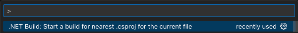

# .NET Build Commands

This extension provides VSCode command extensions to be used with `launch.json` and `tasks.json`.
The purpose is to avoid having to configure every launch and build task manually for every project
one might have and keep the configuration more maintainable.

Even though the C# Dev Kit has some of this functionality, it does not provide flexibility in
configuring the build tasks or the launch tasks. For instance you might want to have specific
arguments passed along to the build or the debugger, but don't want to have to configure these
for all your projects.

This extension is somewhat opinionated and supports the following workflows:

* [Run a build task and select which project to build](#build-tasks-and-project-selection)
* [Launch a debugging session and select which project to launch](#launch-debugger-with-project-selection)
* [Build the project nearest to the current focused file](#building-project-in-context)

## Commands

Below are all the commands available:

| Command | Description | Output |
| ------- | ----------- | - |
| dotnet-build-commands.selectProject | Select a project | Full path of selected project |
| dotnet-build-commands.selectProjectForLaunch | Select a project for launch and set a variable for pre launch tasks (build) to use | Full path of selected project |
| dotnet-build-commands.selectedProject | Get the selected project | Full path of selected project |
| dotnet-build-commands.getTarget | Get the target / output path from the selected project | Full path of the target to launch |
| dotnet-build-commands.buildFromContext | Build the project nearest to the current focused file | - |

## Projects.json

The goal is to not duplicate the configuration, but we still need to know what projects you want to
show for both the build and launch. This is defined using a JSON file that looks like the following.
The JSON file can be shared between a `launch.json` file and a `tasks.json` file.

```json
[
    {
        "name": "Project 1",
        "path": "<full path to the project - can be just the folder>",
        "outputPath": "<Optional full path to the file that will be used as program in debugger>"
    },
    {
        "name": "Project 2",
        "path": "<Full path to the project - can be just the folder>",
        "outputPath": "<Optional full path to the file that will be used as program in debugger>"
    },
    {
        // Project that will not show up in the project picker when launching
        "name": "Project 3",
        "path": "<Full path to the project - can be just the folder>"
    }
]
```

> Note: Paths support using the expression ${workspaceFolder}. The `outputPath` is optional. If you don't include this
> the project will not show up in the launch list.

## Build tasks and project selection

The `tasks.json` file supports the concept of `inputs`.
This extension provides commands that can be used as inputs.

Below is an example showing how to use it:

```json
{
    "version": "2.0.0",
    "tasks": [
        {
            "label": "build",
            "command": "dotnet",
            "type": "process",
            "args": [
                "build",
                "--no-restore",
                "/property:GenerateFullPaths=true",
                "/consoleloggerparameters:NoSummary",
                "${input:project}"
            ],
            "problemMatcher": "$msCompile",
            "runOptions": {
                "reevaluateOnRerun": false
            }
        }
    ],
    "inputs": [
        {
            "id": "project",
            "type": "command",
            "command": "dotnet-build-commands.selectProject",
            "args": {
                "file": "${workspaceFolder}/.vscode/projects.json"
            }
        }
    ]
}
```

The sample shows the `inputs` being configured using the `dotnet-build-commands.selectProject` command
of the extension. This takes a required argument pointing to the `projects.json` file.

### Rerun

Notice the following section in the sample `tasks.json`:

```json
"runOptions": {
    "reevaluateOnRerun": false
}
```

This tells VSCode to provide the previously known input values, which means you do a rerun of the
build task without having to be asked for which project. Which can be handy.

This task can easily then be mapped to keys, as you can see as a sample in following image (CTRL+SHIFT+CMD+B).


## Launch debugger with project selection

As with the `tasks.json` you can also create inputs in your `launch.json`.
Below you'll see an example of how to use the extension:

```json
{
    "version": "0.2.0",
    "configurations": [
        {
            "name": "launch",
            "type": "coreclr",
            "request": "launch",
            "preLaunchTask": "build",
            "cwd": "${input:project}",
            "program": "${input:target}",
            "stopAtEntry": false,
            "env": {
                "ASPNETCORE_ENVIRONMENT": "Development"
            },
            "internalConsoleOptions": "openOnSessionStart"
        },
    "inputs": [
        {
            "id": "project",
            "type": "command",
            "command": "dotnet-build-commands.selectProjectForLaunch",
            "args": {
                "file": "${workspaceFolder}/.vscode/projects.json"
            }
        },
        {
            "id": "target",
            "type": "command",
            "command": "dotnet-build-commands.getTarget"
        }
    ]
}
```

The input `project` is configured using `dotnet-build-commands.selectProjectForLaunch` which does the
same as `dotnet-build-commands.selectProject` but also sets an internal flag that the build task configured in
`preLaunchTask` is aware of and uses to know which context it is resolving in. The `cwd` property of the
configuration then uses the input using `${input:project}`.

The second input `target` is configured using `dotnet-build-commands.getTarget` which resolves from the
selected projected the `outputPath` configured. The `program` property of the
configuration then uses the input using `${input:target}`.

## Building project in context

The extension exposes a command that lets you build the nearest `.csproj` for the currently focused
file in an editor. Simply run the `.NET Build: Start a build for nearest .csproj for the current file`



If you'd like you can then map this to a keyboard shortcut. The identifier of the command is `dotnet-build-commands.buildFromContext`.

The command will use a build task defined in `tasks.json`. If you only have one task, it will use this.
Otherwise it will look for the task marked as the default task.
